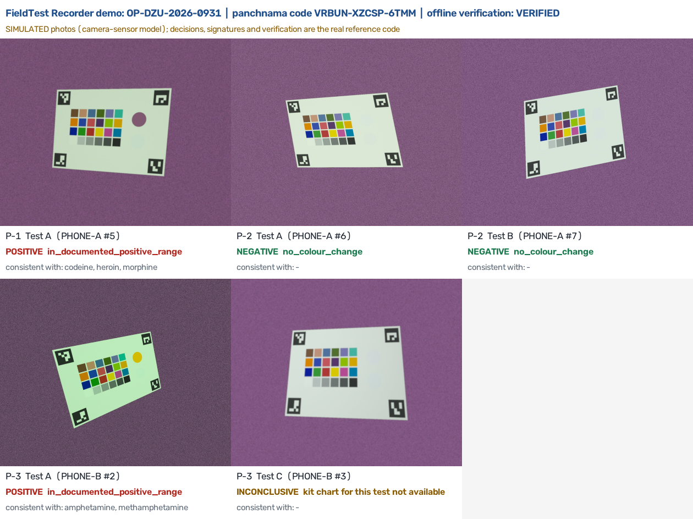
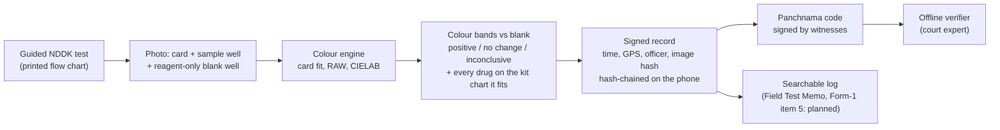

# FieldTest Recorder

**SIH 2026 · SIH26231 · Digital Companion for Field Drug Testing (Narcotics Control Bureau, MHA)**


A guided, measured and signed field test for NCB's **Narcotic Drugs Detection Kit**, designed to run offline on the officer's phone:
- follow the kit's printed Tests A–E;
- photograph each reaction beside a reagent-only blank well on a reference colour card;
- read the colour against a signed colour standard;
- turn every result into a tamper-evident record with time, GPS, officer and image hash that an independent expert can verify offline.

> **Status.** This repository is a working **reference prototype** (Python) of the core: record format, offline verifier, trust model, colour engine, NCB kit protocol, searchable log and sync protocol. It is the executable specification the Android app must match. **The Android app is not built yet.** Colour results come from simulated photos; nothing has been measured on a real phone or a real NCB reaction. All keys are test keys. Every claim below is labelled proven in code, simulated, or not built.



## The problem

1. Officers test every seized packet with the kit and judge the colour **by eye** against a printed chart. They write the result in the panchnama ("dark brown").
2. That result drives the NDPS procedure before any lab report exists:
   - classification (Rule 3);
   - Form-1 within 48 h;
   - which packets are sampled together (Rule 10(2));
   - remand and bail.
3. Nothing proves the test happened at that place and time. The Bombay High Court found that NCB "has not prescribed the standards" and called field testing "arbitrary" (*Sagar Parshuram Joshi*, 2021).
4. A colour test identifies a **group** of drugs, not one drug. NCB's own chart says Test E's blue means "cocaine or methaqualone". Wrongly naming the drug changes the NDPS quantity category, as in the Anuraj case, where alleged MDMA was methamphetamine.

## Try it (Python 3.11)

```bash
pip install -r requirements.txt
python demo/run_demo.py          # full workflow in ~15 s -> demo/output/report.html
pytest                           # 47 tests, ~30 s
```

**The demo** (a pre-generated copy is in [`docs/demo/report.html`](docs/demo/report.html); download and open it) covers one seizure with two officers, two phones and three packets:
1. **P-1:** the flow chart picks Test A. The reading is positive against the blank, consistent with codeine, heroin or morphine, and the app warns that the NDPS quantity category can't be decided in the field.
2. **P-2:** no colour change on Test A, then Test B, then "stop testing" exactly as the printed flow chart says.
3. **P-3:** tablet, amphetamine range. Test C is marked *inconclusive*, because its chart isn't printed in the guide; the app does not guess.
4. **Signing:** every capture is signed and chained, and the phones' ranges become a 14-character panchnama code with a check character.
5. **Offline verification:** the raid is **VERIFIED** while an earlier, unrelated case on the same phone stays hidden.
6. **Tampering:** four tampering attempts are **caught**; a one-character typo in the code is reported as a typo; the search log finds records and re-verifies them when opened.

**The demo is a best case.** Its photos are simulated under one light (white LED) with no glare, and its reaction colours are the chart colours the bands were built from, so the readings are expected to be right. Tube tests (B, E) are drawn as flat wells. It hashes the saved JPEG, not the RAW frame the engine measures. Failure cases are in the experiments and in the [problem register](ftr-reference/docs/research/unresolved-problems.md).

## What is built, and how we know

| Part | Status | Evidence |
|---|---|---|
| Record format: signed header + payload with time, GNSS time, GPS + mock-location flag, officer, image hash; hash chain | **Proven in code** | 18/18 tampering attacks caught (`ftr-reference/test_integrity.py`). Not yet checked offline: implausible or backwards times, binding validity, revocation (U28) |
| Trust model: NCB supervisor list → supervisor-signed phone binding → phone key; our server is never trusted | **Proven in code** with test keys (software keys stand in for the phone's hardware key) | Insider-admin forgery caught. Attestation checker: accept + reject paths 19/19 on test certificates (`e15_attestation.py`); no validity-date or app-identity checks yet (U30); no real phone enrolled |
| Panchnama anchor: every phone's record range + chain head; code with check character | **Proven in code** | Deleted/re-run records caught; 434/434 single-character typos detected |
| Verify one raid without disclosing other cases | **Proven in code** | Other cases disclosed as hashes only |
| Sync protocol: idempotent, fork/replay detection, durable checkpoints, search | **Proven in code** (SQLite reference server) | 15/15 failure scenarios (`e14_failures.py`) |
| Searchable offline log that re-verifies on open | **Proven in code** | 10/10 checks (`test_log.py`) |
| NCB kit as a signed guided protocol: Tests A–E, flow charts, narrowing across tests, NDPS quantity warning | **Built** (protocol and decision logic) | Colours sampled from the scanned printed chart: approximate. Tube tests B and E: instructions only, the engine cannot read a tube or its lower layer yet (U29). The chart lists drugs only, so non-drug look-alikes are not named (U31) |
| Colour engine: card detection, correction, RAW tier, **blank well**, colour bands across sample amount | **Simulated** | 0.0% false positives across 0.5–1.6× sample amount on published US colours (old point rule: up to 11.7%). NCB-kit bands tested only on the chart's own colours: a consistency check, not accuracy (E17). JPEG-only, glare and sodium-light weaknesses and blank-well contamination are open (U27, U32) |
| Android app (Kotlin), camera capture, hardware-backed keys, Field Test Memo, Form-1 item 5 and BSA s.63 outputs, Spring Boot server, real-phone and real-kit validation | **Not built yet** | Designed; planned for the finale |

The full evidence trail covers 17 experiments with 95% intervals, the decisions they forced, an unresolved-problem register, an external review we verified claim by claim, and an independent adversarial audit whose confirmed findings are fixed or listed as U27–U34. It's in [`ftr-reference/docs/research/`](ftr-reference/docs/research/); start with [`validation-results.md`](ftr-reference/docs/research/validation-results.md).

## How it works



**Design choices:**
- **No neural network:** a colour test cannot identify a drug, and a court must be able to re-run the reading. Decisions use colour bands computed from the kit's own chart and published physics.
- **No blockchain:** phone-signed chains plus the witnessed panchnama do the job, and even our own server admin cannot forge a record.

The target architecture is in [`docs/pages/FieldTest-Recorder-Architecture.html`](docs/pages/FieldTest-Recorder-Architecture.html) (download and open; diagrams render in browsers with Mermaid support). It describes the full design; the table above says which parts exist.

## Known limitations

Each has an ID in the [problem register](ftr-reference/docs/research/unresolved-problems.md).

- **No app yet:** camera capture, hardware-backed keys, liveness, night mode and the Field Test Memo / Form-1 / BSA s.63 outputs are designed, not built. Liveness and night mode exist only as separate simulations.
- **Colour accuracy** is simulated with a camera-sensor model and chart colours from a scanned book. Real phones, printed cards and real NCB reactions are untested (U2, U24, U33).
- **Tube tests** B and E cannot be read by the engine yet (U29).
- **Blank well:** if sample gets into the blank well, a real positive can read "no colour change" (U27).
- **Look-alikes:** some published amphetamine colours fall in the chart's mescaline band, and non-drug substances that react are not listed (U31).
- **Light:** with JPEG only, 3 of 96 simulated NCB-kit photos were read wrongly; glare makes most readings inconclusive; sodium street light is always rejected (U25, U32).
- **Verifier:** no offline checks yet for implausible times, binding validity or revocation; the attestation checker lacks validity-date and app-identity checks (U28, U30).
- **Kit gaps:** Tests C and D aren't printed in the guide, so they return "inconclusive" until NCB's kit sheet is added (U23).
- **Staged samples:** a sample swapped exactly at the reagent drop, or a replayed video, can't be caught from colour alone (U5).
- **Users:** no officers, chemists or prosecutors have been interviewed yet (U6, U7).

## Repository map

| Path | What it is |
|---|---|
| `ftr-reference/` | Reference implementation, experiments E1–E17, signed profiles, tools ([its README](ftr-reference/README.md)) |
| `demo/run_demo.py` | End-to-end demo |
| `tests/` | Test suite run by CI |
| `ftr-reference/docs/research/` | Evidence trail |
| `ftr-reference/docs/validation/` | Real-phone test protocol and printable reference card |
| `docs/deck/` | SIH idea presentation (PDF) and its build script |
| `docs/sources/SOURCES.md` | Primary sources with links |

## Safety and legal

- **No narcotics:** the team never handles narcotics. Colour work uses published colours, the kit chart and safe dyes; real-kit validation is designed for NCB or CFSL chemists.
- **Test keys only:** the signing keys in this repository are **TEST-ONLY**. Production keys belong to NCB and never leave its hardware.
- **Presumptive only:** results are presumptive. They never replace the laboratory report.

© 2026 the team. All rights reserved; licence to be decided by the team.
